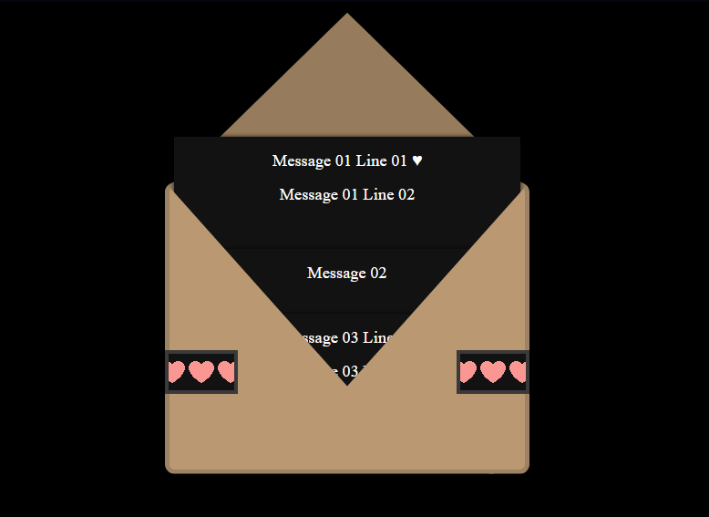

# 💌 Heart Envelope Animation

A sweet little interactive front-end project made to celebrate a special day. This animated envelope opens to reveal a series of heartfelt notes — a digital love letter to an important person in your life.

Built using **HTML, CSS, JavaScript**, and **GSAP**, this project mimics the charm of opening a paper envelope, making it a beautiful way to share your feelings online.

---

## 🌷 Features

- ✨ Beautiful animated envelope that opens with a click
- 💬 Multiple floating notes with personal messages
- 📱 Responsive design for mobile and tablet views
- 🎯 Interactive experience with dynamic CSS transitions
- 🔧 Fully customizable content and styling

---

## 🛠️ Technologies Used

- HTML5
- CSS3 (Media Queries + Animations)
- JavaScript (Vanilla JS)
- GSAP (GreenSock Animation Platform)

---

## 📂 Folder Structure

| Folder/File       | Purpose                                      |
|-------------------|----------------------------------------------|
| `index.html`      | Main HTML structure                          |
| `css/style.css`   | Styling and layout                           |
| `js/script.js`    | Animation logic with GSAP                    |
| `images/demo.gif` | (Optional) Screenshot or screen recording    |

---

## 🎁 How to Use

1. Clone the repository:
   ```bash
   git clone https://github.com/its-aleezA/heart-envelope-animation
   Open index.html in any browser.

2. Click the sticker to start the animation ✂️

3. You can edit the note contents inside the .note__text sections in index.html.

---

📸 Demo



---

🧑‍🎨 Author

[Aleeza Rizwan](https://github.com/its-aleezA)

---

🔖 License

This project is licensed under the MIT License.
See the [LICENSE](LICENSE) file for details.
